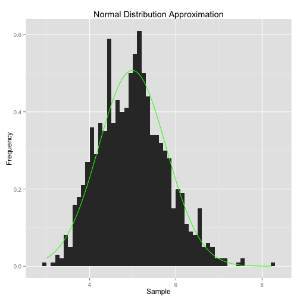

## Central Limit Theorem

Let $\{ X_{1} , \cdots , X_{n} \}$ be a sequence of I.I.D random variables of size $n$ drawn from distributions of expected values given by $\mu$ and finite variance given by $\sigma^2$. 

Suppose we are interested in the sample average
$$ \bar X_{n} = \frac{X_{1} + \cdots + X_{n}}{n} $$
of these random variables. 

The CLT states that as $n$ gets larger, the distribution of $\bar X_n$ is close to the normal distribution with mean $\mu$ and variance $\frac{\sigma^2}{n}$.

---
## Simulation

We fixed a few basic settings to be used during this analysis. 

```r
## setwd("~/.....)    # set the directory
library(ggplot2)      # to be able to graph
set.seed(0)           # to be able to reproduce
```

The following code shows how to build 1000 simulations of averages of 40 exponentials with $\lambda = 0.2$.


```r
# Number of simulations
numsim = 1000                                                
# Create the simulations
sample = NULL                                                
for (i in 1 : numsim) sample = c(sample, mean(rexp(40,0.2))) 
# Create a dataframe (ggplot)
sample<-as.data.frame(sample)                                
```

---
## Mean and Standard deviation

Now, we calculate the sample mean and sample variance:

```r
mean(sample$sample)
```

```
## [1] 4.989678
```

```r
var(sample$sample)
```

```
## [1] 0.6181582
```
A consequence of the CLT is that the mean and variance of the random variable given by the average are approximated by:

$$\mu = 1/\lambda = 1/0.2 = 5\quad\text{and}\quad\sigma^2/n = 25/40 = 0.625$$

respectively.

---
 

In the following website there is an application where you can move a few parameters of the previous example: [app](http://romath.shinyapps.io/DevelopingDataProducts).


